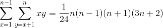
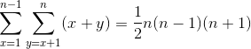
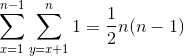

[CodeIQ 公開コード一覧](../README.md)

# 問題
2 以上の自然nに対し、n×n の格子に並んだ点を考える。  
これらの点のうちちょうど 2 個の点を通る直線の数を F(n) と定義する。  
標準出力に F(n) の値を出力するプログラムを書きなさい。  
nの範囲は、2 <= n <= 40とする。

+ 問題ページ(受付終了) [「ストレート・ラインズ」問題](https://codeiq.jp/q/3434)
+ 出題者による解説ページ [数学の問題をプログラミングで解こう！「ストレート・ラインズ」問題解説](https://codeiq.jp/magazine/2017/11/56057/)

# 方針
縦横があるのは n=2のみなので、特例として扱う。  
傾きが +1 または -1 であるものは、n>2 に対して常に4つしかないので、これも特例として扱う。  

条件を満たす、傾きが b/a (aとbは互いに素、0 < a < b) である直線の本数は、以下のようになる。  
+ 1 < b <= [n/3] の場合は、2ab  
+ [n/3] < b <= [n/2] の場合は、-n^2 + 3(a+b)n - 7ab
+ [n/2] < b <= n-1 の場合は n^2 - (a+b)n + ab  

ここで、aとbが素でないものも含めて、0 < a < b <= n の範囲で全て合計する。  
この計算では以下の式を使用する。  

+ 
+ 
+ 

ここから、aとbが互いに素ではない組み合わせの個数を削除する。  
aとbの最大公約数が kである場合、a = ka'、b = kb'　とすることで、その個数を求めることができる。  

k=2とk=3の組み合わせについて削除すると、k=6の組み合わせが二重に削除されているので、埋め合わせで加える。  
この処理を素数の組み合わせとして処理する。

n > 2 の場合は、鏡像と90度回転があるので、この値を4倍し、傾きが1である直線として、4を加えたものが答えである。  
n = 2 の場合は、F(2) = 6であるのは自明。  

この処理自体は、概ね O(N)で出来るので、全体としては素数を求めるための O(N log N)オーダで解けるはず。

# コード
[solve.py](/3434/solve.py)

