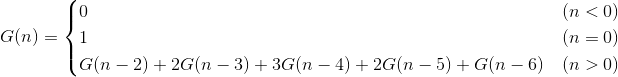

[CodeIQ 公開コード一覧](../README.md)

# 問題
ある数からスタートし、交互に最大3つまでの数をカウントダウンしていき、最後に「0」を言った方が負け、というゲームがある。  
整数 n が与えられたとき、Aが n からスタートし、最後にBが「0」を言うパターンが何通りあるか求めなさい。  

自分から負けるために、「1, 0」のように言うことはないものとします。  
n は1≦n≦50を満たすものとします。  
[今週のお題:カウントゲームで先手が勝つのは何通り？](https://codeiq.jp/q/3467)

# 方針
Bの番である時の数字がnで、負ける手順の個数を G(n) とすると、G(n)は以下の様に求めることが出来る。

  

<!--
  G(n) = \begin{cases}
    0 & (n<0) \\
    1 & (n=0) \\
    G(n-2)+2G(n-3)+3G(n-4)+2G(n-5)+G(n-6) & (n>0)
  \end{cases}
-->

Aか勝つのは、Bが負ける場合なので、G(n-1)+G(n-2)+G(n-3)である。

# コード
[solve.py](solve.py)
