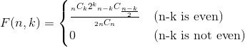

# 問題
「ペア・ドロップ」問題  

n を自然数とする。  
1 から n までの自然数が 1 つずつ書かれた n 枚のカードが 2 組ある。  
これら 2n 枚のカードをよく混ぜ、A と B の 2 人に n 枚ずつ配る。  
A と B は、それぞれ自分の持ち札の中に番号が一致するカードがあればその 2 枚を捨てる。  
 
捨てられるカードを全て捨てた後の A の持っているカードの枚数が k である確率を F(n, k) とする。  
標準出力に 10^6×F(n, k) の整数部分の値を出力しなさい。
nとkは、1 ≦ k ≦ n ≦ 100 であるものとする。
 
なお、全てのテストケースで、 10^6×F(n, k) の値とその最寄りの整数は 10^-3 以上離れていることが保証されている。  
 
+ [CodeIQ](https://codeiq.jp/q/3485)

# 方針
方針と言うか、身も蓋もないが、以下の式で求める事ができる。  

<!-- 
F(n,k) = \begin{cases}
\frac{{_n C _k}2^k {_{n-k}C_{\frac{n-k}{2}}}}{_{2n} C _n} & \text{(n-k is even)}  \\
0 & \text{(n-k is not even)}
\end{cases}
-->

+ [コード](solve.py)

# 感想
普通に確率の問題。  
特に工夫もしてないので、計算の途中でoverflowしないか若干不安だったけど、まぁなんとか。  
